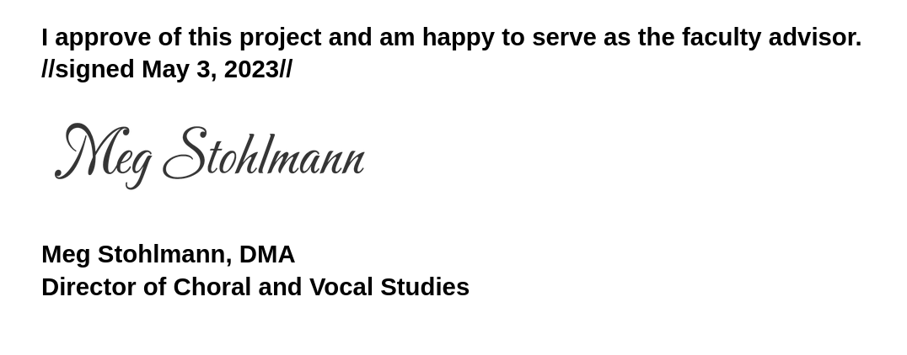

# HONS Prospectus: Choir and AI
### Trevor Bushnell

## Project Description

AI has become a hot topic within the last year. With the rise of ChatGPT, Google’s Bart, and Microsoft’s BingAI, we’ve seen AI utilized in many places, especially surrounding education. While some researchers have tried to create AI that can generate choral music, no one has talked about how this AI generated music impacts people from the singer’s perspective. While some research has been done surrounding how AI is impacted in the choral setting, most research simply bases it off of whether it sounds similar to the original composer. However, in reality many AI models choose to write voice parts that are outside the comfortable range of the singer and don’t keep the singer in mind at all when writing new music.

This project aims to work with singers to determine the success of AI generated choral music as it stands today. The goal will be to research any models that already exist for generating choral music and try to regenerate voice parts using AI. Additionally, this project will see how well the parts are written for a singer to be able to perform successfully. This project will specifically focus on the work of Bach’s chorales because there is lots of data to train on and they are short pieces that can be quick to learn. This project is interdisciplinary as it combines computer science (with the AI component) with the choral arts. 

## Methodology

To start, research will be conducted on the different possible AI models that already exist that can re-score Bach chorales. Currently one model I have found that can do this is DeepBach, but it is important that I find other models as well. This will mean looking through research papers to understand these various models and try running the models on my own development machine. I will also try to see if I can develop my own model, but this may not be feasible as I don’t have an extensive background to create a really intense model that would perform anywhere near as well as people with PhD’s in computer science. This research phase will conclude with me picking 2-3 Bach chorales and generating their AI counterparts.

Next is the performance aspect with the choirs. This will entail creating a choir (either through an audition process or on an invite basis) that will learn all the chorales and their AI counterparts. This choir would rehearse once per week for 60-90 minutes with myself as the director helping teach the music. Throughout the process, I will ask members of the choir how they feel when performing real Bach versus performing the AI versions of Bach. 

## Final Product & Public Facing Component

The final product (which is also the public facing component) will take either one of two approaches:

1. A documentary explaining the research behind the AI, its relevance in the choral space, and having the choirs sing it in order to see the differences in the scores
2. A presentation at the ACDA Northwest conference where I bring the choir and give a presentation explaining the AI and showing the differences using the choir

## Assessment Plan

The following 4 things will need to be completed in order to ensure that this was a successful project:

1. Determine models and songs by end of Summer 2023
2. Build a choir by end of September 2023
3. Have a script for the presentation/documentary finished by the end of October 2023
4. Have a documentary by the end of the semester (December 2023) OR present at ACDA Northwest January 24 - 27

## Timeline

1. Summer 2023
   1. Research other AI models beyond DeepBach
   2. Pick 2-3 chorales and generate music for each model
   3. Try to build my own model if possible
2. September 2023
   1. Recruit singers to join the project
   2. Start rehearsing choir at end of month
   3. Work with faculty advisor on conducting skills?
3. October 2023
   1. Continue rehearsing choir
   2. Work with faculty advisor on conducting skills?
   3. Write script for documentary (or presentation)
   4. Meet with members of the choir to see how they feel when they sing the music
4. November 2023
   1. Begin recording whatever pieces I need (if doing the documentary)
      1. Continue rehearsing the choir otherwise
   2. Record the members reactions to singing the music (if needed for documentary)
   3. Begin editing final product
5. December 2023
   1. Continue editing final product
   2. Rehearse choir if needed
6. January 2024 (if needed)
   1. Rehearse choir
   2. Present at ACDA Northwest

## Materials Needed

* Choir - ideally 8-12singers (2-3 voices per part)
  * preferably GU students but might need to pull from Symphony Chorale
* Rehearsal pianist - already secured (Henry Stone)
* Maybe some funds to treat the choir to pizza or some other meal as a thank-you for working on the project?

## Advisor Approval / Signature

